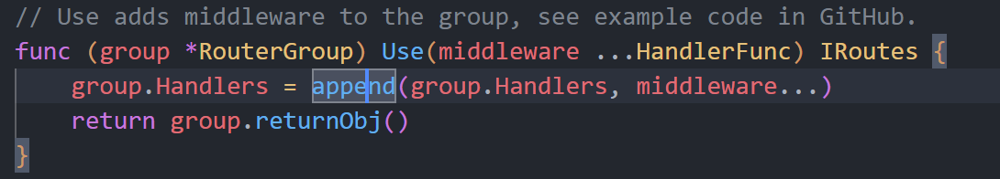
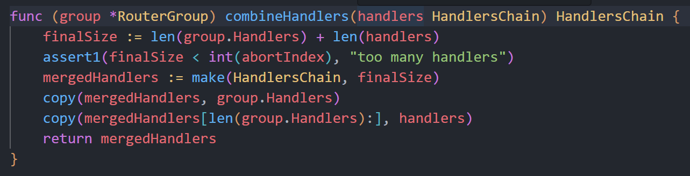

# Restful Server

一个 go server，基于 Restful 的设计风格，用于简单模拟 task 调度。

项目介绍地址：[Go 中的 REST 服务器：第 1 部分 - 标准库 - Eli Bendersky 的网站 (thegreenplace.net)](https://eli.thegreenplace.net/2021/rest-servers-in-go-part-1-standard-library/)

## 1. taskstore

一个简单的用map实现的task数据库，以及一些提供的接口，例如创建task,根据id,tags,due获取和删除task等。以及通过使用sync.Mutex来保证并发安全。

提供的接口如下所示：

```
POST   /task/              :  create a task, returns ID
GET    /task/<taskid>      :  returns a single task by ID
GET    /task/              :  returns all tasks
DELETE /task/<taskid>      :  delete a task by ID
GET    /tag/<tagname>      :  returns list of tasks with this tag
GET    /due/<yy>/<mm>/<dd> :  returns list of tasks due by this date
```

后续可以考虑更新为用mysql,redis等来实现。

## 2. taskServer

使用taskstore的相关接口，来实现server，使得能够正常使用store的功能。

使用最简单，传统的net/http提供的路由实现。

golang更新到 1.22 之后，官方的 net/http 的 pattern 就支持为如下格式了:

> [METHOD ][HOST]/[PATH]

其他具体的改变，可以查看文档:[http package - net/http - Go Packages](https://pkg.go.dev/net/http@master#ServeMux)获取更详细的信息。

## 3. 路由聚合

关于路由聚合的方法介绍，见[Go 中 HTTP 路由的不同方法 (benhoyt.com)](https://benhoyt.com/writings/go-routing/)。

这里介绍了相当多的路由匹配的方式，例如正则表达式，拆分路径，使用第三方 package 等。

也尝试了几种，例如使用gorilla/mux，以及使用gin来重写路由。

## 4. 使用Swagger

我们最开始规范的定义的store的接口并不符合rest规范，也没有合适的doc来描述这些接口。

因此，使用Swagger/OpenAPI来完善我们的接口设计。

## 5. MiddleWare-中间件

写的很好的一个文章：[Life of an HTTP request in a Go server - Eli Bendersky's website (thegreenplace.net)](https://eli.thegreenplace.net/2021/life-of-an-http-request-in-a-go-server/)

在介绍中间件之前，我们再次回顾一下关于net/http中极为经典的一个实现：Handler接口。


一个好用的middleware package，[justinas/alice: Painless middleware chaining for Go (github.com)](https://github.com/justinas/alice)。

这个包把臃肿的中间件嵌套，例如(mw1(mw2(mw3...mwn(app))))，转变为这样的形式：(其实就是把这些Handler用链串联，然后递归调用即可)

```
alice.New(Middleware1, Middleware2, Middleware3).Then(App)
```

另外，使用gin框架时，可以从这里[Gin-Gonic (github.com)](https://github.com/gin-contrib/)找到各种中间件，不需要自己手搓了。

关于中间件执行的顺序，在gin中，这取决于注册和调用ctx.Next的时机。参考[go原理系列| 理解gin中间件的运行](https://juejin.cn/post/6874493914930380808)

在gin中，中间件通过r.Use注册，注册，实际上就是把中间件加入到HandlerChain中，每次调用ctx.Next时，就会从中取下一个中间件执行(即递归调用)。也就是说，如果某个中间件先注册，但是没有调用ctx.Next，那么调用链就会在这里中断，后面的中间件是不会执行的。

查看源码，中间件的注册(即router.Use)最终是这样的：



而router.Get,Post等函数最终是这样的：



可以看到其实这部分的功能是一样的，都是往Handlers的末尾添加一个新的Handler。(但是因为combineHandlers是拷贝Chain的副本，因此，只有在这之前注册的中间件会被加入对应的路由中，所以中间件的注册一定要在路由之前。)

因此，使用Use和Get的先后也就影响了这些Handler在HandlderChain中的顺序，在调用ctx.Next时也会受到影响。至于中间件的逻辑和主程序的先后，在调用Next之前即为先执行，在调用Next之后即为后执行。

另外，中间件虽然有好处，但是不宜过多，过多的中间件延长了路由处理的流程，使得代码的读取和调试更加复杂。尽量使用少的中间件。


