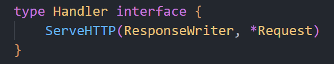

# Restful Server

一个 go server，基于 Restful 的设计风格，用于简单模拟 task 调度。

项目介绍地址：[Go 中的 REST 服务器：第 1 部分 - 标准库 - Eli Bendersky 的网站 (thegreenplace.net)](https://eli.thegreenplace.net/2021/rest-servers-in-go-part-1-standard-library/)

## 1. taskstore

一个简单的用map实现的task数据库，以及一些提供的接口，例如创建task,根据id,tags,due获取和删除task等。以及通过使用sync.Mutex来保证并发安全。

提供的接口如下所示：

```
POST   /task/              :  create a task, returns ID
GET    /task/<taskid>      :  returns a single task by ID
GET    /task/              :  returns all tasks
DELETE /task/<taskid>      :  delete a task by ID
GET    /tag/<tagname>      :  returns list of tasks with this tag
GET    /due/<yy>/<mm>/<dd> :  returns list of tasks due by this date
```

后续可以考虑更新为用mysql,redis等来实现。

## 2. taskServer

使用taskstore的相关接口，来实现server，使得能够正常使用store的功能。

使用最简单，传统的net/http提供的路由实现。

golang更新到 1.22 之后，官方的 net/http 的 pattern 就支持为如下格式了:

> [METHOD ][HOST]/[PATH]

其他具体的改变，可以查看文档:[http package - net/http - Go Packages](https://pkg.go.dev/net/http@master#ServeMux)获取更详细的信息。

## 3. 路由聚合

关于路由聚合的方法介绍，见[Go 中 HTTP 路由的不同方法 (benhoyt.com)](https://benhoyt.com/writings/go-routing/)。

这里介绍了相当多的路由匹配的方式，例如正则表达式，拆分路径，使用第三方 package 等。

也尝试了几种，例如使用gorilla/mux，以及使用gin来重写路由。

## 4. 使用Swagger

我们最开始规范的定义的store的接口并不符合rest规范，也没有合适的doc来描述这些接口。

因此，使用Swagger/OpenAPI来完善我们的接口设计。

## 5. MiddleWare-中间件

写的很好的一个文章：[Life of an HTTP request in a Go server - Eli Bendersky's website (thegreenplace.net)](https://eli.thegreenplace.net/2021/life-of-an-http-request-in-a-go-server/)

在介绍中间件之前，我们再次回顾一下关于net/http中极为经典的一个实现：Handler接口，它的定义如下：



任何实现了ServeHTTP的类型都可以作为Handler接口来传递。另外，http.ListenAndServe需要的第二个参数也是handler，也仅仅是一个handler即可，也就是说，我们甚至可以传递一个空的结构体(但不是nil，是nil时会自动使用DefaultServeMux)给它，只要这个结构体实现了ServeHTTP函数。

再进一步，我们还可以使用http.HandlerFunc这个适配器来把函数标签和ServeHTTP相同的函数转换为Handler接口(这是因为HandlerFunc自己就实现了ServerHTTP，虽然其实现其实就是把参数传递给它的成员函数)。

由此，我们引申出中间件，中间件是一个函数，类似于HandlerFunc的实现方式，(在默认情况下，其他框架如gin各有不同的实现方式，但是思路还是这个思路)它接收一个Handler，同时返回一个Handler。在其内部，它会在调用它的参数Handler之前或之后，添加一部分自己的逻辑，这就是它的功能了。

很明显，一个中间件还可以嵌套其他中间件，这就组成了我们的中间件链了。中间件是一个嵌套的，或者说类似于递归的方式来调用的，就像这样：

```
m1(m2(m3(app))) 
	==>
m1 -> m2 -> m3 -> app -> m3 back -> m2 back -> m1 back
```

一个好用的middleware package，[justinas/alice: Painless middleware chaining for Go (github.com)](https://github.com/justinas/alice)。

这个包把臃肿的中间件嵌套，例如(mw1(mw2(mw3...mwn(app))))，转变为这样的形式：(其实就是把这些Handler用链串联，然后递归调用即可)

```
alice.New(Middleware1, Middleware2, Middleware3).Then(App)
```

### gin的中间件

使用gin框架时，可以从这里[Gin-Gonic (github.com)](https://github.com/gin-contrib/)找到各种中间件，不需要自己手搓了。

关于中间件执行的顺序，在gin中，这取决于注册和调用ctx.Next的时机。参考[go原理系列| 理解gin中间件的运行](https://juejin.cn/post/6874493914930380808)

在gin中，中间件通过r.Use注册，注册，实际上就是把中间件加入到HandlerChain中，每次调用ctx.Next时，就会从中取下一个中间件执行(即递归调用)。也就是说，如果某个中间件先注册，但是没有调用ctx.Next，那么调用链就会在这里中断，后面的中间件是不会执行的。

查看源码，中间件的注册(即router.Use)最终是这样的：


而router.Get,Post等函数最终是这样的：


可以看到其实这部分的功能是一样的，都是往Handlers的末尾添加一个新的Handler。(但是因为combineHandlers是拷贝Chain的副本，因此，只有在这之前注册的中间件会被加入对应的路由中，所以中间件的注册一定要在路由之前。)

因此，使用Use和Get的先后也就影响了这些Handler在HandlderChain中的顺序，在调用ctx.Next时也会受到影响。至于中间件的逻辑和主程序的先后，在调用Next之前即为先执行，在调用Next之后即为后执行。

另外，中间件虽然有好处，但是不宜过多，过多的中间件延长了路由处理的流程，使得代码的读取和调试更加复杂。尽量使用少的中间件。在能保证功能互不影响的情况下，一个中间件聚合多个逻辑都是可以的。

## 6. 身份验证

即在之前的基础上，对于获得的请求进行身份验证，如何做？

使用HTTPS，或者说，把http传输的数据使用TLS(Transport Layer Security)进行加密。

### TLS加密

参考这些：

- [RSA - 理论与实现 ](https://eli.thegreenplace.net/2019/rsa-theory-and-implementation/)
- [Diffie-Hellman 密钥交换](https://eli.thegreenplace.net/2019/diffie-hellman-key-exchange/)
- [[Go HTTPS servers with TLS](https://eli.thegreenplace.net/2021/go-https-servers-with-tls/)

#### RSA非对称加密算法

我们使用到以下数据进行加密和解密：

- M: 要加密的数据的二进制数
- p,q: 两个很大的质数(非常大，至少600位10进制数)
- n: n=p\*q
- e: 一个相对小的奇素数, 可以直接使用65537
- φ(n): 即[欧拉的 totient 函数](https://en.wikipedia.org/wiki/Euler's_totient_function)，在这里，由于p,q都是大质数，φ(n)=(p-1)\*(q-1)
- d: e在模φ(n)下的乘法逆元，存在且唯一
- C: 加密后的密文
- 公钥即为[n,e]，私钥即为[n,d]

我们采用的加密过程非常简单，但是有效，即：

- C = Encode(M) = M^e^ % n 
- M = Decode(C) = C^d^ % n

证明如下：

1. M = Decode(c) = Decode(Encode(M)) = M^ed^ % n
2. ed ≡ 1 (mod φ(n))，即ed = 1+kφ(n) = 1+k(p-1)(q-1)
3. 由费马小定理，当M,p互质时，有M^p-1^ ≡ 1(mod p)
4. 因此，M^ed^ %n = M(M^p-1^)(M^q-1^) % (pq) = M(另外，如果恰好当M,p不互质(虽然几乎不可能)那么仍有M^q-1^ % q = 1，也还是有M^ed^ % q = M，依然成立)
5. 综上，我们证明了使用这样的方式来加密和解密是保证数据不损坏的。
6. 安全性，破译时，我们只能得到n,e(即公钥)和C，由于对n的大整数分解是非常困难的，几乎不可能正确的拆分出p与q，也就无法得到d进行解密。

在网络上，公钥是公开的，私钥则只有目标才能得到。传输时，使用公钥加密，对方收到后使用私钥解密即可。

#### 密钥交换

参考[密钥协商（密钥交换）机制的讲解](https://blog.csdn.net/CHYabc123456hh/article/details/108788580)

- RSA
  - 客户端连上服务端
  - 服务端发送 CA 证书给客户端
  - 客户端验证该证书的可靠性
  - 客户端从 CA 证书中取出公钥
  - 客户端生成一个随机密钥 k，并用这个公钥加密得到 k’
  - 客户端把 k’ 发送给服务端
  - 服务端收到 k’ 后用自己的私钥解密得到 k，此时双方都得到了密钥 k，协商完成。
  - 之后服务器和客户端都只需要使用k进行加密和解密即可

#### TLS加密流程

- 就是上面的RSA密钥交换过程，在建立TCP连接的3次握手后就会进行密钥交换
- 证书被称为X.509证书，目的是确保这些公钥和签名是可靠的，而不是随意的

在go中，使用tls加密通信和原本的http差异并不大，只需要额外配置证书，配置Server的TLS字段，以及使用ListenAndServeTLS即可，很简单。

另外，客户端也要把服务器所提供的证书加入自己的TLSClientConfig中，以便在建立TCP连接时放行(即视为该证书有效)。

通过本地随机生成的自签名证书可能不会被浏览器相信(这也是当然的)，还有几种简便的方法生成证书：

```
go run /usr/local/go/src/crypto/tls/generate_cert.go -help
//这种方式和自己编写的方式生成的证书差不多，也无法让浏览器相信
```

- 另一种方式则是使用包[A simple zero-config tool to make locally trusted development certificates](https://github.com/FiloSottile/mkcert)，通过这个包生成的证书是可以被浏览器相信的。

除了服务器提供证书之外，服务器还可以要求客户端也提供证书，这称之为双向TLS(mTLS)。实现方式也不难，客户端持有证书之后，为Client的证书字段配置好，在发送请求时即可携带该证书。服务器也在Server的证书字段配置信任的客户端证书即可，其余检查的事情，服务器会做好的。

## GraphQL

参见这里 [GraphQL](https://spec.graphql.org/June2018/) 来了解更多信息。

GraphQL也是一种设计风格，和REST不同的设计风格。

在REST中，例如，在本样例中，如果Task结构体还携带有很多其他数据，而这些数据是客户端使用getalltask不希望收到的，即客户端收到的垃圾信息过多，在网络上传输这些信息的开销也更大，这称之为over-fetching(过度抓取)。

为改进这些问题，我们或许可以考虑拆分出更多的api，例如getalltaskid,getwholetaskbyid,getparttaskbyid，等来尽量满足客户端的需求而减少网络流量。但是这样改进之后，需要获取到全部的详细的task信息又变得更麻烦，我需要先获取全部的taskid,再遍历taskid获取每个task。这另一方面又加大了服务器的负载(原本的一个请求变成了很多个请求)，而客户端单次收到的信息又可能不足。这称之为under-fetching(抓取不足)。

GraphQL就是解决该问题所提出的一种设计风格。它在服务器方面，使用GraphQL来实现，而客户端把所需要的信息发给服务器，(在这个例子中)服务器在获取到所有的task后，会按照sql那样，根据客户端的需求筛选出合适的task再返回。实现一个合适的fetching。

听上去很美好，但是实际上实现起来较为麻烦和复杂，而不像REST那样和HTTP配合得那么好，同时保持代码的简洁。


至此，这个项目就到此结束了。总的来说还是很有收获的，包括起初的接口设计，新的go路由(gorilla,gin,go1.22更新的mux)，Swagger(接口详细显示)，HTTPS原理和应用，以及GraphQL。之后，可以运用这里的经验重新写一个别的server。

另外，这个专题也可以一看：[Embedding in Go: Part 1 - structs in structs ](https://eli.thegreenplace.net/2020/embedding-in-go-part-1-structs-in-structs)。


